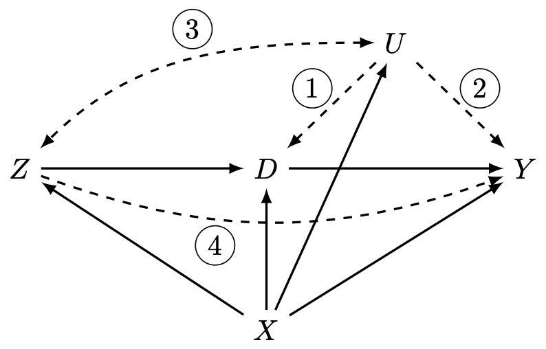

```{r, include = FALSE}
knitr::opts_chunk$set(
  collapse = TRUE,
  comment = "#>"
)
options(digits = 4)  # Set number of significant digits
```

In this vignette we use the `optsens` package to conduct sensitivity analysis
for a regression and instrumental variable (IV) model that estimates the linear
causal effect of education on income. This package is based on @freidling2025.


## The NLSYM Data

The National Longitudinal Survey of Young Men (NLSYM) was initiated in the United States
in 1966 and contains a sample of 3010 young men between the ages of 14 and 24 who
were followed up until 1981. This data set was compiled and analysed by @card1993 who used it
to investigated the causal effect of education on log-income. The data is available in the R-package [ivmodel](https://cran.r-project.org/web/packages/ivmodel/index.html). We load
the data and select the variables that we use in the analysis below.

```{r}
library(ivmodel)

data(card.data)
data <- card.data[,c("lwage", "educ", "nearc4",
                     "exper", "expersq", "black", "south", "smsa")]
knitr::kable(head(data))
```

Description of the variables:

- `lwage`: log-transformed income
- `educ`: education measured in years of schooling
- `nearc4`: indicator for the presence of a 4-year college in the local labour market

- `exper`: potential experience (age - education - 6)
- `expersq`: quadratic transformation of `exper`
- `black`: indicator for being black
- `south`: indicator for living in the southern United States
- `smsa`: indicator for living in a standard metropolitan statistical area


## Regression and IV Estimates

To begin with, we examine two standard approaches of estimating the linear
causal effect of education on income: the ordinary least squares (OLS) estimator stemming from a regression model and the two stage least squares (TSLS) estimator stemming from an IV model.

For the regression model, we use the `lm` function.
```{r}
reg.mod <- lm(lwage ~ educ + nearc4 + exper + expersq + black + south + smsa,
              data = data)

print(coef(reg.mod)["educ"])
print(confint(reg.mod, level = 0.95)["educ",])

```

For the IV model, we use the `ivmodel` and `KClass` functions from the `ivmodel` package that we have loaded above.
```{r}
y <- data[, "lwage"]
d <- data[, "educ"]
z <- data[, "nearc4"]
x <- data[, c("exper", "expersq", "black", "south", "smsa")]

iv.mod <- ivmodel(Y = y, D = d, X = x, Z = z,
                  intercept = TRUE, alpha = 0.05, k = 1)
kclass <- KClass(iv.mod, k = 1, alpha = 0.05)
print(kclass$point.est)
print(kclass$ci)
```

We see that the two estimates are quite different despite trying to estimate the same quantity. Moreover, the regression model yields a very narrow 95% confidence interval whereas the IV model provides a comparatively wide one.

Indeed, one needs to be careful under which conditions the OLS and TSLS estimates actually warrant a causal interpretation.

First, we need to make some assumptions on the "order" of variables in the data-generating mechanism. (This is important for choosing the right adjustment set, for instance.) For the NLSYM data, we assume that the variables accord to the directed acyclic graph (DAG) below. This is plausible as the variables are measured in different years which naturally imposes a temporal order.

```{r, echo=FALSE, out.width='70%'}

```

Second, we require assumptions on variables that are not observed and therefore not part of the data set. Note that we develop our methodology for _one_ unmeasured confounder $U$ but one can also think about $U$ as a "super-confounder" that combines the influence of multiple unmeasured variables. The OLS estimator is unbiased when one of the following two conditions holds
\[
R_{D\sim U\vert X,Z} = 0,\qquad R_{Y\sim U\vert X,Z,D}=0,
\]
where $R_{A\sim B \vert C}$ denotes the partial correlation of $A$ and $B$ given $C$. In the graph, this corresponds to the absence of at least one of the edges 1 and 2.
The TSLS estimator is unbiased when the following three conditions hold
\[
R_{D\sim Z\vert X} \neq 0,\quad R_{Z\sim U\vert X}=0, \quad R_{Y\sim Z\vert X,U,D} =0.
\]
The first condition corresponds to the existence of the edge $Z \to D$, whereas the latter two correspond to the absence of the edges 3 and 4, respectively.

As @card1993 pointed out, it is likely that there are important unmeasured variables $U$ that render the identification assumptions for the OLS and TSLS estimators above invalid. Hence, we recommend to conduct *sensitivity analysis* that specifies a range of plausible values for the sensitivity parameters $R_{D\sim U\vert X,Z}, R_{Y\sim U\vert X,Z,D}, R_{Z\sim U\vert X}$ and $R_{Y\sim Z\vert X,U,D}$, instead of overly optimistically assuming that they are equal to 0.


## Partially Identified Range and Sensitivity Intervals

To conduct sensitivity analysis for the OLS and TSLS estimator, we first load the `optsens` package. Then, we generate a sensitivity analysis object `sa` with the NLSYM data. (The parameters `indep_x` and `dep_x` describe two disjoint subsets of the covariates. This is explained in the subsection on comparative bounds in more detail.) Then, we print the newly created sensitivity object to inspect it.

```{r}
library(optsens)

sa <- sensana(y = y, d = d, indep_x = c("black", "south"),
              dep_x = c("exper", "expersq", "smsa"),
              quantile = "t", x = x, z = z, alpha = 0.05)

print(sa, digits = 5)
```

We see that `sa` contains the OLS and TSLS estimator along with their 95% confidence intervals. These agree with the outputs of `lm` and `ivmodel`. Moreover, `sa` administers a (currently empty) data frame containing bounds on the sensitivity parameters.

In the following two subsections, we describe how to add different types of bounds and compute the partially identified range as well as sensitivity intervals. For ease of exposition, we assume that the unmeasured confounder $U$ is the intrinsic motivation of a person but one may think of various other unmeasured variables and conduct sensitivity analysis for them in a similar way.


### Direct Bounds

The most straightforward way of specifying a sensitivity model is putting direct bounds on the sensitivity parameters. For instance, we may impose
\[
R_{D\sim U\vert X,Z} \in [-0.2, 0.5],\qquad R_{Y\sim U\vert X,Z,D} \in [-0.2, 0.4].
\]
The first constraint expresses the belief that the partial correlation of education and motivation given the covariates and the instrument lies in between -0.2 and 0.5. Since a positive dependence between education and motivation seems more plausible, the interval gives more leeway in the positive direction. We may apply a similar reasoning for the partial correlation between income and motivation and the second bound. We can add these constraints to `sa` as follows.

```{r}
sa <- add_bound(sa, arrow = "UD", kind = "direct", lb = -0.2, ub = 0.5)
sa <- add_bound(sa, arrow = "UY", kind = "direct", lb = -0.2, ub = 0.4)
```

We see that the bounds were indeed successfully added and given the names `b1` and `b2`. (The names can also be customized in the `add_bound` function.)
```{r}
print(sa)
```

Subject to the specified bounds, the linear causal effect of education on income is not point identified anymore. This means that we can only estimate a (partially identified) range of values instead of a single number. The `optsens` package uses a grid search algorithm to this end. (We recommend to use at least 100 grid points per dimension.)
```{r}
grid_specs <- list(N1 = 200, N2 = 200, N5 = 200)
pir1 <- pir(sa, grid_specs = grid_specs)

print(pir1)
```
The _partially identified range_ (PIR) that we obtain of course contains the OLS estimate but does not contain 0. Hence, we can conclude that the estimate of the causal effect is still positive even if unmeasured confounding occurs that is no larger than the specified bounds.

The PIR, however, does not account for sampling variability. Therefore, we also want to construct a confidence interval for the PIR which we call a _sensitivity interval_. To this end, we use a bootstrap approach which is implemented in the `sensint` function.

```{r}
sensint1 <- sensint(sa, alpha = 0.05, boot_samples = 3500,
                    grid_specs = grid_specs)
print(sensint1)
```
The resulting data frame contains the lower and upper ends (`sl` and `su`) of the sensitivity interval for different bootstrap procedures (`percent`, `basic` and `bca`). We recommend to mostly use the BCa method as it corrects for bias and skewness in the bootstrap distribution. Note that `bca` requires at least as many bootstrap samples `boot_samples` as there are data points in the data set. The last column `conservative` is only relevant when comparative bounds are specified; see the following subsection. In general, we recommend to use the conservative sensitivity interval.

We notice that the 95% sensitivity interval does not contain 0. Hence, we can conclude that even in the presence of the specified unmeasured confounding a positive effect of education on income is significant.

Beyond bounds on $R_{D\sim U\vert X,Z}$ and $R_{Y\sim U\vert X,Z,D}$, we can also put bounds on the TSLS sensitivity parameters.
```{r}
sa <- add_bound(sa, arrow = "ZU", kind = "direct", lb = -0.3, ub = 0.3)
sa <- add_bound(sa, arrow = "ZY", kind = "direct", lb = -0.1, ub = 0.1)
```
Note that bounds on $R_{Z\sim U\vert X}$ and $R_{Y\sim Z\vert X,U,D}$ alone are generally not sufficient to get a finite PIR. Hence, we recommend to specify at least one other bound when doing sensitivity analysis for the TSLS assumptions.

We compute the PIR and sensitivity interval of the updated sensitivity model as follows.
```{r}
pir2 <- pir(sa, grid_specs = grid_specs)
print(pir2)

sensint2 <- sensint(sa, alpha = 0.05, boot_samples = 3500,
                    grid_specs = grid_specs)
print(sensint2)
```
Interestingly, `pir1` and `pir2` are identical and `sensint1` and `sensint2` are almost the same. This indicates that the two new constraints did not contribute to the sensitivity model. This is a first sign that even small violations of the TSLS assumptions may lead to large deviations from the estimate.

To investigate this further, we remove the previous bounds on $U\to D$ and $U \to Y$, put a very loose bound on $U\to D$ and recompute the PIR and sensitivity interval.
```{r}
sa <- remove_bound(sa, "b1")
sa <- remove_bound(sa, "b2")
sa <- add_bound(sa, arrow = "UD", kind = "direct", lb = -0.9, ub = 0.9)

pir3 <- pir(sa, grid_specs = grid_specs)
print(pir3)

sensint3 <- sensint(sa, alpha = 0.05, boot_samples = 3500,
                    grid_specs = grid_specs)
print(sensint3)
```

Both the PIR and the sensitivity interval are quite large compared to the expected effect size. This shows that even moderately small deviations from the TSLS identification assumptions can lead to vastly different estimates and statistical conclusions. Therefore, the regression approach seems a lot more robust towards unmeasured confounding than the IV approach for the NLSYM data.

In many cases, it may be hard to confidently specify a plausible range of values for the sensitivity parameters. Therefore, we introduce bounds that compare $U$ with an observed covariate in the next subsection.

### Comparative Bounds

First, we remove the previously specified bounds. This is purely for ease of exposition, however.

```{r}
sa <- remove_bound(sa, "b3")
sa <- remove_bound(sa, "b4")
sa <- remove_bound(sa, "b5")

print(sa)
```

To specify comparative bounds, we need to make one additional assumption on the covariates: We suppose that $X$ can be divided into two disjoint sets $\tilde{X\hspace{-0.06em}}$ such $\dot{X\hspace{-0.01em}}$ that the following condition holds
\[
R^2_{U \sim \dot{X\hspace{-0.01em}} \vert \tilde{X\hspace{-0.06em}}, Z} =0.
\]

This means that the covariates $\dot{X\hspace{-0.01em}}$ cannot explain any variation in the unmeasured confounder if we also account for $\tilde{X\hspace{-0.06em}}$ and the instrument $Z$. Therefore, one may think about $\dot{X\hspace{-0.01em}}$ as covariates that are in some sense "independent" of the unmeasured confounder and of $\tilde{X\hspace{-0.06em}}$ as "dependent". When we created the `sa` object at the start of the previous section, we specified this partition of the covariates via the `indep_x` and `dep_x` parameters.

We chose the covariates `black` and `south` as $\dot{X\hspace{-0.01em}}$-covariates because we believe that motivation $U$ does not correlate with them after controlling for other covariates. For the remaining covariates, we are not entirely sure; so, we designate them as $\tilde{X\hspace{-0.06em}}$-covariates. In the following, we use covariates in $\dot{X\hspace{-0.01em}}$ and compare them to the unmeasured confounder $U$ to obtain more interpretable bounds.

Let us first consider the OLS sensitivity parameters. We may for instance choose the indicator for being black (here denoted as $\dot{X\hspace{-0.01em}}_j$) as comparison variable and specify the comparative bound
\[
R^2_{D \sim U \vert \tilde{X\hspace{-0.06em}}, \dot{X\hspace{-0.01em}}_{-j}, Z} \leq 4\, R^2_{D \sim \dot{X\hspace{-0.01em}}_j \vert \tilde{X\hspace{-0.06em}}, \dot{X\hspace{-0.01em}}_{-j}, Z}.
\]
This bound expresses the belief that being black can explain _at most 4 times_ as much variation in education as motivation can, after controlling for the other covariates and the instrument. In many settings, it may be easier to specify such a comparative bound and reason about whether one should choose a larger or smaller number than 4 than imposing a direct bound on $R_{D\sim U\vert X,Z}$.

Similarly, we can also specify a bound on the relationship between $Y$ and $U$:
\[
R^2_{Y\sim U\vert \tilde{X\hspace{-0.06em}}, \dot{X\hspace{-0.01em}}_{-j}, Z, D} \leq 5\, R^2_{Y\sim \dot{X\hspace{-0.01em}}_j\vert \tilde{X\hspace{-0.06em}}, \dot{X\hspace{-0.01em}}_{-j}, Z, D}.
\]
This corresponds to the belief that being black can explain _at most 5 times_ as much variation in income than motivation can, after accounting for the remaining covariates, the instrument and education $D$.

We can add these constraints to `sa` as follows.
```{r}
sa <- add_bound(sa, arrow = "UD", kind = "comparative", b = 4, I = "south", J = "black")
sa <- add_bound(sa, arrow = "UY", kind = "comparative-d", b = 5, I = "south", J = "black")

print(sa)
```
Here, `J` refers to the comparison covariate and `I` is a subset (usually the entire set) of the remaining $\dot{X\hspace{-0.01em}}$-covariates. There also exists a version of the second bound that does not control for $D$; to apply this constraint, use `kind = "comparative"`.

As before, we can now compute the PIR and the sensitivity interval.
```{r}
pir4 <- pir(sa, grid_specs = grid_specs)
print(pir4)

sensint4 <- sensint(sa, alpha = 0.05, boot_samples = 3500,
                    grid_specs = grid_specs)
print(sensint4)
```

Similarly, we can also specify comparative constraints for the TSLS sensitivity parameters, for instance:

$$
\begin{align}
R^2_{Z\sim U\vert \tilde{X\hspace{-0.06em}}, \dot{X\hspace{-0.01em}}_{-j}} &\leq 0.5\, R^2_{Z\sim \dot{X\hspace{-0.01em}}_j\vert \tilde{X\hspace{-0.06em}}, \dot{X\hspace{-0.01em}}_{-j}}\\
R^2_{Y\sim Z\vert X, U, D} &\leq 0.1\, R^2_{Y\sim \dot{X\hspace{-0.01em}}_j\vert \tilde{X\hspace{-0.06em}}, \dot{X\hspace{-0.01em}}_{-j}, Z, U,D}
\end{align}
$$

We can add these to `sa` as follows. (Note that we do not need to specify `I` here as this is automatically set as the remaining $\dot{X\hspace{-0.01em}}$-covariates)
```{r}
sa <- add_bound(sa, arrow = "ZU", kind = "comparative", b = 0.5, J = "black")
sa <- add_bound(sa, arrow = "ZY", kind = "comparative", b = 0.1, J = "black")
```

We recompute the partially identified range and the 95% sensitivity interval.

```{r}
pir5 <- pir(sa, grid_specs = grid_specs)
print(pir5)

sensint5 <- sensint(sa, alpha = 0.05, boot_samples = 3500,
                    grid_specs = grid_specs)
print(sensint5)
```
Analogously to the sensitivity model with direct bounds, we notice that adding constraints on $U \leftrightarrow Z$ and $Z \to Y$ does not palpably improve neither the PIR nor the sensitivity intervals. Hence, the analysis is much more sensitive to violations of the TSLS than the OLS assumptions.

We'd like to emphasize that users can use both direct and indirect bounds including on the same arrow. In this vignette, we have only separated them to explain them more easily.

## b- and R-contour plots

When we specify comparative bounds, we need to choose the comparison covariate and the $b$-factor, e.g. being black explains at most 4 times as much variation as motivation, here $b=4$. To examine multiple choices of $b$ at the same time, we can use the `b_contours` function.

We choose two comparative bounds (`"b6"` and `"b7"` in this example) and two corresponding ranges of $b$-values and specify whether we want to plot the lower or upper end of the PIR. Moreover, we choose a value of interest (usually 0) and the `grid_specs_b` parameter which controls how finely `range1` and `range2` are discretized. `b_contours` produces a `ggplot` contour plot that can be printed.

```{r fig.asp = 0.8, fig.width = 8, out.width = "90%"}
b_contour_plot <- b_contours(sa, pir_lower = TRUE,
                             bound1 = "b6", range1 = c(0.1, 12),
                             bound2 = "b7", range2 = c(0.1, 15),
                             val_interest = 0,
                             grid_specs_b = list(N1b = 20, N2b = 20),
                             grid_specs = grid_specs)

print(b_contour_plot)
```

Bounds `"b6"` and `"b7"` use $b$-factors of 4 and 5, respectively. The plot shows that we need to choose values at least twice as large to push the the lower end of the PIR beyond zero. Hence, even more permissive sensitivity models can lead to the qualitatively same conclusion that the estimated effect is positive even when unmeasured confounding occurs.

If users would like to customize the plot, they can use the `b_contours_data` function to just create the data frame which the contour plot is based on and then visualize it themselves. Here is an example how one of the figures in @freidling2025 is created.

```{r fig.asp = 0.8, fig.width = 8, out.width = "90%"}
library(ggplot2)
library(ggrepel)
library(metR)

plot_data <- b_contours_data(sa, pir_lower = TRUE,
                        bound1 = "b6", range1 = c(0.1, 12),
                        bound2 = "b7", range2 = c(0.1, 15),
                        grid_specs_b = list(N1b = 20, N2b = 20),
                        grid_specs = grid_specs)

print(head(plot_data))


text_point <- paste0("(", 4, ", ", 5, ")")
make_breaks <- function(range, binwidth) {
  signif(pretty(range, 15), 4)
}
make_breaks_ex <- function(range, binwidth) {
  b <- make_breaks(range, binwidth)
  b[b != 0]
}

pl <- ggplot(plot_data, aes(x, y, na.rm = TRUE)) +
  geom_contour_fill(aes(z = z, fill = after_stat(level)),
                    breaks = make_breaks,
                    show.legend = FALSE) +
  geom_contour2(aes(z = z, label = after_stat(level)),
                breaks = make_breaks_ex,
                col = "black",
                label_size = 5,
                linewidth = 0.25) +
  geom_contour2(aes(z = z, label = after_stat(level)),
                breaks = 0,
                linewidth = 1.25,
                label_size = 7,
                col = "black") +
  scale_fill_discretised(low = "#0072B2", high = "#F0E442") +
  geom_point(data = data.frame(x = 4, y = 5), size = 3,
             mapping = aes(x, y), col = "black") +
  geom_text_repel(data = data.frame(x = 4, y = 5, label = text_point),
                  mapping = aes(x, y, label = label),
                  col = "black",
                  size = 6,
                  xlim = c(0, 13),
                  ylim = c(0, 15)) +
  labs(x = expression("b"["UD"]),
       y = expression("b"["UY"])) +
  scale_x_continuous(breaks = seq(0, 12, by = 2)) +
  theme_bw() +
  theme(plot.title = element_blank(),
        axis.text = element_text(size = 20),
        axis.title = element_text(size = 20),
        title = element_text(size = 20))

print(pl)
```


Beyond $b$-contour plots, we offer $R$-contour plots which visualize the estimated causal effect as a function of $R_{D\sim U\vert X,Z}$ and $R_{Y\sim U\vert X,Z,D}$. As this does not require bounds, we can remove the previously specified bounds. In order to focus on the non-extreme values of the sensitivity parameters - in other words _to zoom in_ - we specify direct bounds on $U\to D$ and $U\to Y$. This is optional, though. 

```{r}
sa <- remove_bound(sa, "b6")
sa <- remove_bound(sa, "b7")
sa <- remove_bound(sa, "b8")
sa <- remove_bound(sa, "b9")

sa <- add_bound(sa, arrow = "UD", kind = "direct", lb = -0.75, ub = 0.75)
sa <- add_bound(sa, arrow = "UY", kind = "direct", lb = -0.75, ub = 0.75)
```

In addition to the contours of the estimated causal effect, we can plot comparison points that provide context for the order of magnitude of the sensitivity parameters. To this end, we choose some of the $\dot{X\hspace{-0.01em}}$-covariates and different multipliers for each of them. This is done in the `comparison_ind` list. We pass this parameter along with other already familar ones to `r_contours`. Here, we choose `comparison = "comp-d"`; other options are `"comp"` (analogous to a comparative bound on $U\to Y$ that does not account for $D$) and `"naive"` which is not recommended. Setting `iv_lines = TRUE` would also plot the combinations of values that $R_{D\sim U\vert X,Z}$ and $R_{Y\sim U\vert X,Z,D}$ need to fulfill if $Z$ is indeed a valid instrument; these combinations typically form two lines in the plotted plane.

```{r fig.asp = 0.8, fig.width = 8, out.width = "90%"}
comparison_ind <- list(black = c(1, 2, 5), south = c(1, 2, 5))
grid_specs <- list(N1 = 400, N2 = 400, N5 = 400)

r_contour_plot <- r_contours(sa, val_interest = 0,
                             comparison_ind = comparison_ind,
                             comparison = "comp-d",
                             iv_lines = FALSE,
                             grid_specs = grid_specs)

print(r_contour_plot)
```

The $R$-contour plot shows that an unmeasured confounder that is five times as strong as being black or living in the southern US would still not suffice to completely push the estimate to 0.

Analogously to the $b$-contour plots, there also exists an `r_contours_data` function which provides the underlying data and allows the users to create the plot themselves according to their preferences. See the Github repository [optsens-replication](https://github.com/tobias-freidling/optsens-replication) for more examples of how to use this and other functions.


## References